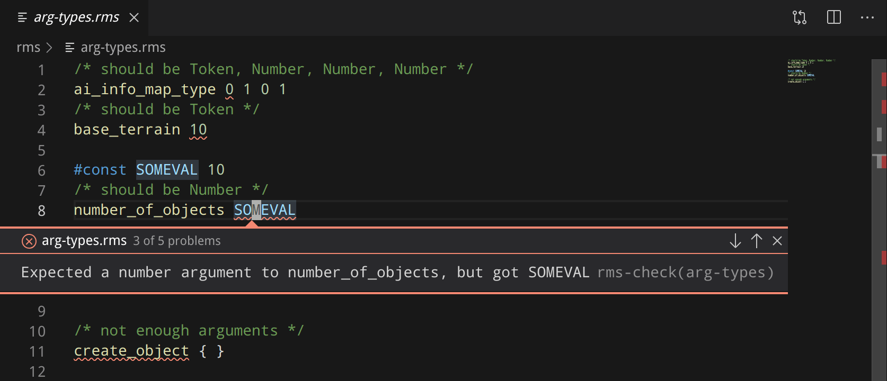

# rms-check

A linter and language server for Age of Empires 2 random map scripts.

[Usage](#usage) - [Status](#status) - [Install](#install) - [License: GPL-3.0](#license)



## Usage

```
rms-check 0.1.0

USAGE:
    rms-check [FLAGS] [file] [SUBCOMMAND]

FLAGS:
        --aoc        Set the default compatibility to Age of Conquerors. Scripts can override this using `/*
                     Compatibility: */` comments.
    -h, --help       Prints help information
        --hd         Set the default compatibility to HD Edition. Scripts can override this using `/* Compatibility: */`
                     comments.
        --up14       Set the default compatibility to UserPatch 1.4. Scripts can override this using `/* Compatibility:
                     */` comments.
        --up15       Set the default compatibility to UserPatch 1.5. Scripts can override this using `/* Compatibility:
                     */` comments.
    -V, --version    Prints version information
        --wk         Set the default compatibility to WololoKingdoms. Scripts can override this using `/* Compatibility:
                     */` comments.

ARGS:
    <file>    The file to check, when not using any subcommand.

SUBCOMMANDS:
    check     Syntax check and lint a random map script.
    fix       Auto-fix problems with a random map script.
    help      Prints this message or the help of the given subcommand(s)
    pack      Pack a folder into an Zip-RMS map.
    server    Start the language server.
    unpack    Unpack a Zip-RMS map into a folder.
```

```bash
rms-check "/path/to/aoc/Random/Everything_Random_v4.3.rms"
```

## Status

There is a simple parser and some lints for highlighting common problems. There is also a barebones language server implementation that provides diagnostics and folding ranges.

In the future, I'd like to support more language server-y things, like automatic formatting, completions, and hover help.

## Install

Currently no binaries are provided. Installation must be done by compiling this repository from source.

First, get rustup: https://rustup.rs/

Then do something like:

```bash
# download rms-check:
git clone https://github.com/goto-bus-stop/rms-check.git
cd rms-check
# build it:
cargo build --release
# run it!
./target/release/rms-check FILENAME
```

## License

[GPL-3.0](./LICENSE.md)
